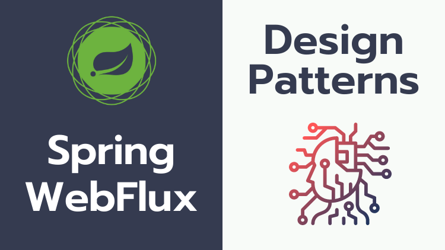

# Design Patterns with Spring WebFlux

This repo contains the source code for all the sections discussed in this course.

Spring WebFlux is a reactive non-blocking web stack which scales better & provides better performance compared to traditional Spring Web MVC! In this course, we learn various integration and resilient design patterns with Spring WebFlux to build Reactive Microservices.

By the end of this course you would be comfortable with:

## Integration Patterns:
Handling multiple reactive microservices communication in a much better way!

 - Gateway Aggregator Pattern
 - Scatter Gather Pattern
 - Orchestrator Pattern (SAGA - for parallel workflow)
 - Orchestrator Pattern (for sequential workflow)
 - Splitter Pattern

## Resilient Patterns:
How to create more robust & resilient reactive microservices.
- Timeout Pattern
- Retry Pattern
- Circuite Breaker Pattern
- Rate Limiter Pattern
- Bulkhead Pattern